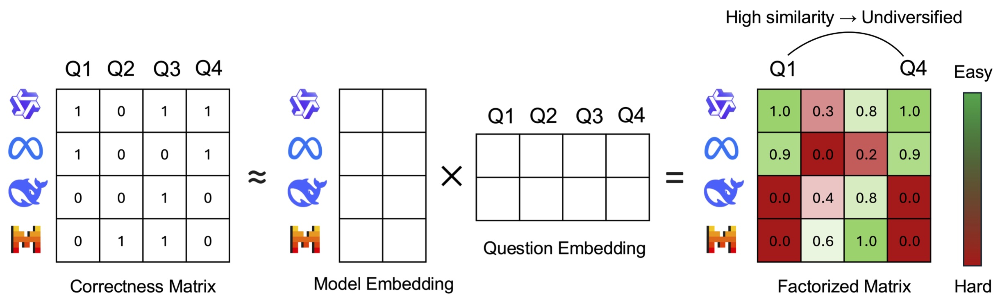

# Difficulty-Diversity Collaborative Filtering
The source code for the paper [Difficulty–Diversity Collaborative Filtering for Data-Efficient LLM Fine-Tuning](https://openreview.net/forum?id=n9mXlqD2SJ).

If you have any questions, please don't hesitate to contact me: longhp1618@gmail.com 

<p align="center"> 
    
</p>  

# Scripts Overview

| Script | Description |
|--------|-------------|
| `infer.py` | Run inference and verification on seed data for a specific model. Running all models listed in `DDCF_data/model_order.csv` produces the full binary correctness data. |
| `create_training_data` | Split full binary correctness data into training and validation sets for the correctness predictor. |
| `get_question_embeddings.py` | Compute seed embeddings and full-corpus embeddings. |
| `train_correctness_predictor.py` | Train the correctness predictor. |
| `fullcorpus_difficulty_estimation.py` | Estimate difficulty per example for a given model; results are saved under `factorized_data/`. |
| `k_greedy_selection.py` | Perform k-greedy selection to balance difficulty and diversity. |

# Data Preparation

You can either download our processed datasets (including 1,000-example curated sets) from [Hugging Face](https://huggingface.co/collections/iNLP-Lab/ddcf) or prepare data yourself.

1. **Download full corpus and seed corpus**
   ```bash
   python download_ddcf_math_from_hf.py
   ```

2. **Binary correctness matrix** — either download precomputed data:
   ```bash
   python download_binary_correctness_from_hf.py
   ```
   or run inference for each collaborative model (running all models in `DDCF_data/model_order.csv` yields full binary correctness data):
   ```
   bash run_infer_all_models.sh
   python create_training_data.py
   ```

3. **Question embeddings**
   ```bash
   python get_question_embeddings.py
   ```

4. **Train correctness predictor**
   ```bash
   python train_correctness_predictor.py
   ```

5. **Difficulty estimation and k-greedy selection**
   ```bash
   python fullcorpus_difficulty_estimation.py --model_name Qwen/Qwen2.5-Math-7B
   python k_greedy_selection.py --model_name Qwen/Qwen2.5-Math-7B --lamda 0.2 --num_select 1000
   ```

# Training and Evaluation
```
bash train/run.sh
```


# Citation
If our framework is useful for your research, please consider to cite the paper:
```
@inproceedings{
hoang2026difficultydiversity,
title={Difficulty{\textendash}Diversity Collaborative Filtering for Data-Efficient {LLM} Fine-Tuning},
author={Long P. Hoang and Wenxuan Zhang and Wei Lu},
booktitle={The Fourteenth International Conference on Learning Representations},
year={2026},
url={https://openreview.net/forum?id=n9mXlqD2SJ}
}
```
